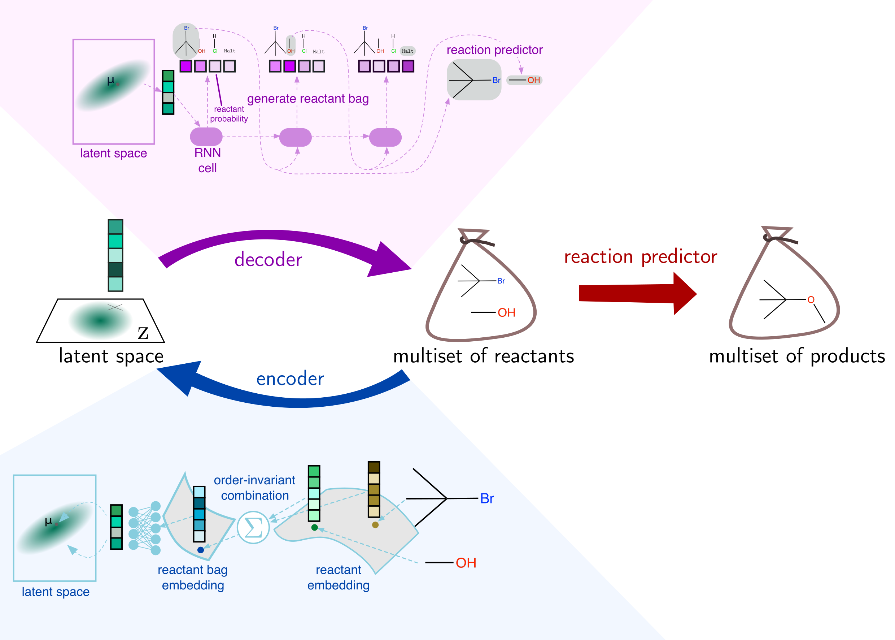

# A Model to Search for Synthesizable Molecules

Core code for the paper "A Model to Search for Synthesizable Molecules" (https://arxiv.org/abs/1906.05221)
 by John Bradshaw, Brooks Paige, Matt J. Kusner, Marwin H. S. Segler, José Miguel Hernández-Lobato. Updated
 to now run on PyTorch 1.2.


## Installation

1. Install the requirements (listed in requirements.txt). We're using Python 3.6.
2. Get the submodules, i.e. `git submodule init` then `git submodule update`  
3. Unzip the data folder: `data.zip` -- this zip folder of processed USPTO data comes from https://github.com/wengong-jin/nips17-rexgen ^*^
4. Add the correct modules to the `PYTHONPATH`, e.g. this can be done by `source set_up.sh`

*PyTorch*  
We have updated the code such that it is using version 1.2 (or 1.3).

*RDKit*  
 We recommend installing rdkit through Anaconda, see e.g.
https://anaconda.org/rdkit/rdkit:  
`conda install -c rdkit rdkit`

*pytest*
Is used for running tests.

*rdfilters*
The quality filters are computed using the `rd_filters` library. This can be found
 [here](https://github.com/PatWalters/rd_filters), and can be installed using:
`pip install git+https://github.com/PatWalters/rd_filters.git`.


^*^ The code for the paper: Jin, W., Coley, C., Barzilay, R. and Jaakkola, T., 2017. 
Predicting organic reaction outcomes with Weisfeiler-Lehman network. 
In Advances in Neural Information Processing Systems (pp. 2607-2616).


### Dockerfile
We have also provided a dockerfile.
This can be used to build a Docker image using eg `docker build . -t molecule-chef`
 if you have the Molecular Transformer weights downloaded into this folder.
It can then be run by `docker run -it molecule-chef`.
An uploaded Docker image lives on Docker Hub [here](https://hub.docker.com/r/johnbradshaw/molecule-chef).


### Molecular Transformer

As mentioned in our paper we use the Molecular Transformer^†^ for reaction prediction. For this task we use the
authors' [official implementation](https://github.com/pschwllr/MolecularTransformer) for running this model. 
The weights that we use can be found on [Google Drive here](https://drive.google.com/file/d/1ogXzAg71BOs9SBrVt-umgcdc1_0ijUvU/view?usp=sharing). 
```bash
shasum -a 256 molecular_transformer_weights.pt
## returns 93199b61da0a0f864e1d37a8a80a44f0ca9455645e291692e89d5405e786b450  molecular_transformer_weights.pt
```

^†^  Schwaller, P., Laino, T., Gaudin, T., Bolgar, P., Hunter, C.A., Bekas, C. and Lee, A.A., 2019.
 Molecular Transformer: A Model for Uncertainty-Calibrated Chemical Reaction Prediction. ACS Central Science.


## Running the Code

### Model Code

As shown below, Molecule Chef consists of an encoder and a decoder. The decoder samples a reactant bag, which can be 
be fed into a reaction predictor (as discussed above we use the Molecular Transformer) to generate output molecules.
The code for the encoder and the decoder can be found in `molecule_chef/model`.




### Scripts
The various scripts in the scripts folder train the model and run experiments:

* `scripts/prepare_data/prepare_datasets.py`: prepares the unzipped USPTO data and extracts reactant bags for training.
* `scripts/train/train_molecule_chef_qed.py`: is used for training Molecule Chef with the property predictor regressing 
from latent space to QED score.
* `scripts/evaluate`: this folder contains scripts to evaluate the learnt model. See the respective readmes on
[generation](scripts/evaluate/generation/generation_readme.md), 
[local optimization](scripts/evaluate/optimize/optimize_readme.md) and 
[retrosynthesis](scripts/evaluate/retrosynthesis/retrosynthesis_readme.md) for further details.

